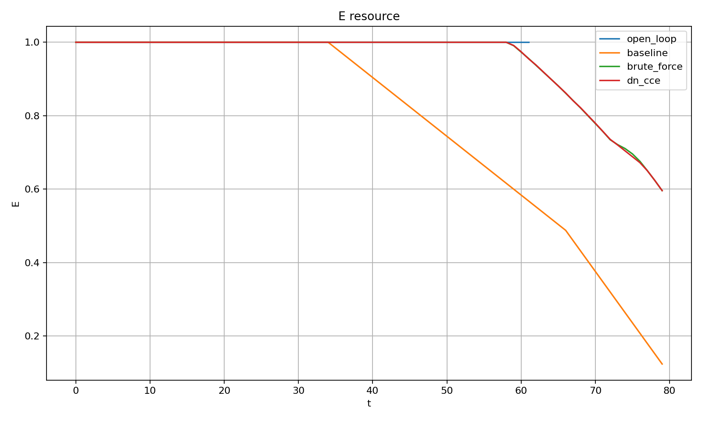
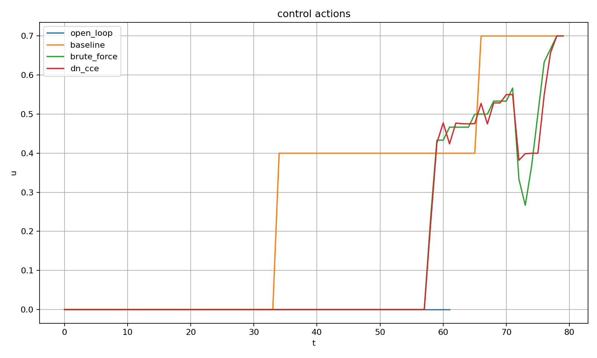
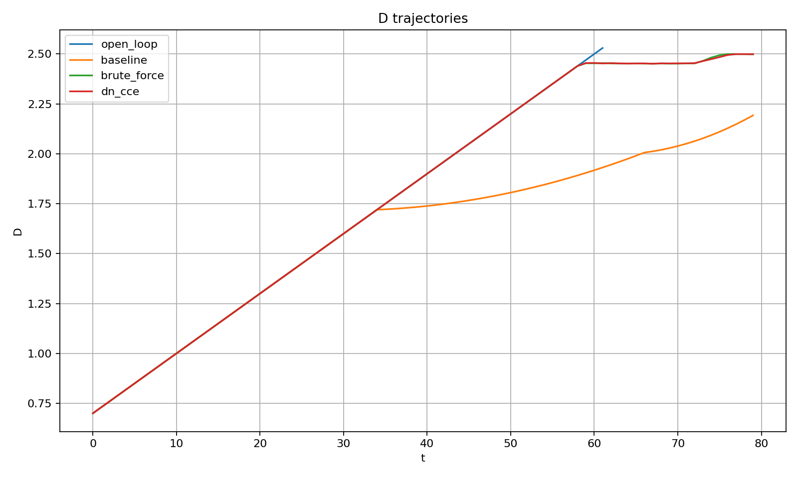

# DN_Plasma_Retention_Control

## Reducing the computational complexity of plasma-retention control using DN model coordinates (ΔN–ΔD)

This research repository demonstrates that the search space of control actions can be substantially reduced while preserving control quality.

---

# About the project

Modern control systems for complex dynamic objects face rapidly growing computational complexity as the number of possible control actions increases. This problem is especially important in plasma-control tasks, where decisions must be made under tight time constraints and the number of possible control actions can grow quickly.

The goal of this project is to investigate whether the number of required computations can be reduced by first estimating the global state of the system in a two-coordinate integral state space: **ΔN** and **ΔD**.

Instead of exhaustively evaluating all possible control options, this repository studies an approach in which ΔN and ΔD are used to rank candidate states and reduce the search space before detailed evaluation.

All experiments are performed on a model calibrated using diagnostic data inspired by the **HL-2A tokamak**.

---

### Conceptual Foundations: The DN Framework

This repository adopts a thermodynamic and systems-oriented representation of complex dynamic behavior using the canonical **DN model** (Duality–Nonequilibrium model).

Instead of describing the system directly through a large set of physical variables, the controller first represents its global state in a two-coordinate state space defined by two macroscopic parameters:

* **ΔN (External Gradient / Nonequilibrium):** Represents the external gradients, driving forces, and energy or particle fluxes that push the system away from thermodynamic equilibrium. In fusion plasmas, ΔN reflects the external conditions under which the plasma is sustained, including heating, fueling, and confinement-related operating parameters.

* **ΔD (Internal Duality / Structural Tension):** Represents the internal structural response of the system to external forcing, including competing tendencies, localized instabilities, and structural heterogeneity. In plasma applications, ΔD may be associated with quantities characterizing evolving stability, current-profile distortions, MHD activity, or other indicators of internal dynamical tension.

Control actions are evaluated within the composite **(ΔN, ΔD)** state space before detailed candidate assessment. This coordinate representation provides a compact description of the global system state and enables efficient ranking and reduction of candidate control actions while preserving control quality.

The objective of this repository is not to replace first-principles plasma physics models, but to investigate whether this low-dimensional coordinate representation can significantly reduce the computational complexity of control decision making.

# What this repository tests

The main research question is:

> **Can a coordinate representation of the system state in the ΔN–ΔD space be used to substantially reduce the number of computations without degrading control quality?**

This repository evaluates the effectiveness of the DN model coordinate representation and a combinatorial reduction algorithm based on it.

Testing the full continuous phenomenological dynamics of the DN model is **outside the scope** of this repository.

**An important result of this study is that high control efficiency was achieved using only the coordinate representation in the ΔN–ΔD space. Explicit use of the continuous analytical dynamics model was not required in this repository.**

---

# Main result

The results show that using ΔN–ΔD coordinates can substantially reduce the number of computational evaluations while preserving almost the same control quality as exhaustive search.

| Method | Evaluations | Total control effort | Residual resource |
|---|---:|---:|---:|
| Baseline Controller | — | 22.60 | 0.124 |
| Brute Force | 4,880 | 10.80 | 0.596 |
| DN coordinate approach | **1,097** | **10.80** | **0.596** |

### Key metrics

- computational evaluations reduced by **4.45×**
- search space reduced by **77.5%**
- control quality almost fully matches brute-force search
- robustness is preserved with measurement noise up to **20%**

---

# Visual results

## Residual system resource

<p align="center">
  
</p>

The DN coordinate approach preserves almost the same residual system resource as brute-force search while requiring far fewer evaluations.

---

## Control actions

<p align="center">
  
</p>

The resulting control strategy is close to the brute-force strategy despite evaluating substantially fewer candidates.

---

## Evolution of the ΔD coordinate

<p align="center">
  
</p>

Evolution of the ΔD coordinate under different control strategies.

---

# Repository structure

```text
Step_01_Environment
    Environment model construction.

Step_02_Baseline_Controller
    Baseline threshold/hysteresis controller.

Step_03_Brute_Force_Controller
    Exhaustive search over control actions.

Step_04_DN_CCE_Controller
    DN coordinate-based combinatorial compression of the control search space.

Step_05_Trajectory_Plots_Report
    Trajectory plots and comparison of control strategies.

Step_06_Noise_Robustness_Test
    Robustness test under measurement noise.
```

---

# Data

The model was developed using diagnostic signals inspired by real **HL-2A tokamak** data.

The model was calibrated using experimental diagnostic signals, including plasma parameters, stability-related characteristics, and other measured quantities.

The original HL-2A experimental datasets are **not included** in this repository.

---

# Limitations

This project is **not a digital twin of the HL-2A tokamak**.

Its purpose is to study computational principles for reducing the search space in decision-making problems for complex dynamic systems.

The results should not be interpreted as a ready-to-deploy industrial control algorithm for a fusion device.

---

# Possible application areas

The proposed approach may be relevant to:

- plasma control;
- intelligent control systems;
- robotics;
- power and energy systems;
- autonomous control systems;
- other decision-making tasks with high combinatorial complexity.

---

# Project status

The current version is a **research prototype**.

The purpose of this public release is to provide a reproducible implementation of the DN coordinate approach and to make the results available for independent verification, discussion, and further development by the scientific community.

---

# Intellectual property

The DN model coordinate approach and related methods may be subject to patent protection.

This repository is published for research, reproducibility, and scientific discussion. See `PATENT_NOTICE.md` for additional information.

---

# Citation

If you use this repository or its results, please cite it using the metadata provided in `CITATION.cff`.
